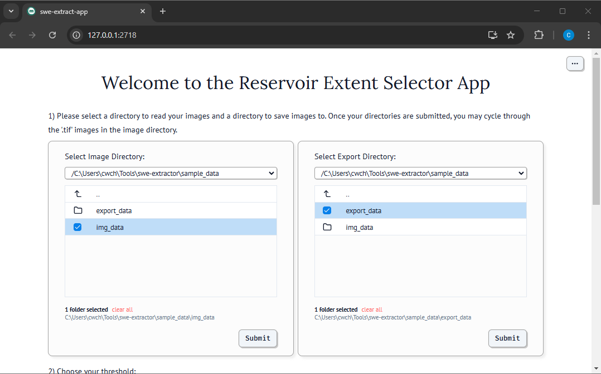
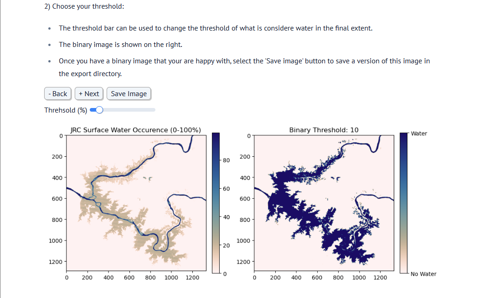

# swe-extractor
This marimo notebook is meant as an example of what is possible when building marimo notebook based apps. It is a Marimo based app to read raster files and export a binary version based on a user defined threshold. Feel free to adapt the code for you use case.

# Installation

This repo is not intended to be installed as a package but only to provide the marimo based python script alongside some sample data.

1) Clone this repository

2) Activate the envornment you wish to run the app in

2) If the needed dependencies are not already installed within your environment. As is the app requires the following dependencies, though you may edit as needed for your purposes.

```python
    import marimo as mo # to run the app
    import rioxarray # to read geotifs
    import matplotlib.pyplot as plt # for plotting
    from cmcrameri import cm # for visualization colormaps
```

# Run the app

1) Navigate to the cloned repo

2) Run the app with marimo within the terminal
```sh
marimo run swe-extract-app.py
```

2) Select the image and export folders


3) Cycle through, edit thresholds and save results
